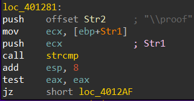

## Description

> I wrote this advanced program to only work on my computer but I think I might have made a mistake somewhere, as I can't even confirm my own identity.

## Challenge overview

The given binary looks for the registry key where the wallpaper location is being set. 

The registry key is located at `HKEY_CURRENT_USER\Control Panel\Desktop\Wallpaper` 

This is parsed and split to get the wallpaper name with extension, where extension must be `.\proof` . If that is verified the flag is printed out

Once all the debugger checks, and the unnecessary instructions are patched out, the binary file would run

## Solution

We can go the the registry key manually using registry editor in windows and then change the wallpaper name to `.proof` which will then get passed onto the parser and split up to reach a `strcmp` instruction.

The check will then proceed to check if the extension of the wallpaper is actually `\proof` 

{{}}

But since we cannot supply `\` inside the registry directly as `wallpaper_pic.\proof` due to the parser demanding the wallpaper name then the extension

{{}}

First the words are split based on the `\`

{{}}

Second, the word is split based on the `.`

Reading the assembly instruction we come across a particular instruction which doesnt make sense initially, 

{{}}

`byte ptr [edx+ecx]` points to the character just before `proof` in the memory

So, rather than going into the debugger then changing the memory just after `strcmp` and this particular instruction which will nullify the character before `proof` . We can just patch that byte to store `\` onto that pointed memory.

{{}}

Patching the byte to store the character `\` 

{{}}

Proof of patch shown at the dump once the patched instruction gets executed

{{}}

This will pass the above check from the binary hence proceeding over to printing the success message and the flag.

{{}}

**Flag: `HTB{Id3nt1ty_c0nf1rmat1on}`**

**Note**: There are other patches applied which are specific for the debugger. The only one patch that is required to make the binary work is the above mentioned one. The other patches with respective to the debugger are `int3` instruction, `cmp` instruction after every debugger check functions.
