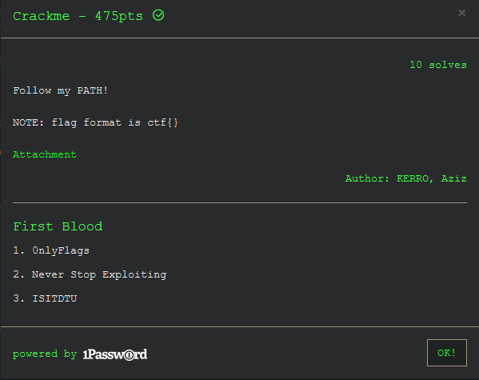

## Description

{{}}

Challenge Author: KERRO, Aziz

## Challenge Overview

The challenge is a VM crackme challenge with 4 registers and a location to store data and opcodes.

## Solution

Every i+3 from 0 is the VM opcode, and there are around 1215 opcodes.

Every i+1 and i+2 from 0 is the values which stored inside the registers (which I named as _rax, _rbx) which will be later used for other operations

{{}}

The opcode is stored in the bytecode array

There are 14 cases in total to be emulated, where most are pretty similar to x86 assembly like, add, sub, xor etc

I set up a VM struct in IDA and cleaned up the decompiled code in IDA

{{}}

As we can see, before running every opcode we set the _rax and the _rbx registers to the i+1 and i+2  of the opcode array that we extracted from IDA

So, I went ahead and emulated this in python,

```python
def vm_opcode():
    i = 0
    k = 0

    while i <= 1215:
        
        rax = opcode[i+1]
        rbx = opcode[i+2]

        if rax < 4 and rbx < 4:
            rbp[rax] = rbp[rax] & 0xff
            rbp[rbx] = rbp[rbx] & 0xff
        data[rbx] = data[rbx] & 0xff
        
        print_info(opcode[i], i, rax, rbx)

        if opcode[i] == 1:
            print(f'mul [rbp+{rax}] rbx  ;  mul {rbp[rax]} {rbx}')
            rbp[rax] = rbp[rax] * rbx
            print(f'res: {rbp[rax]}')

        elif opcode[i] == 2:
            print(f'sub [rbp+{rax}] rbx  ;  sub {rbp[rax]} {rbx}')
            rbp[rax] = rbp[rax] - rbx
            print(f'res: {rbp[rax]}')

        elif opcode[i] == 3:      
            print(f'neg [rbp+{rax}]  ;  {rbp[rax]}')
            res = int(tohex(~rbp[rax], 32), 16) & 0xff
            rbp[rax] = res
            print(f'res: {rbp[rax]}')

        elif opcode[i] == 4:
            print(f'xor [rbp+{rax}] [data+{rbx}]  ;  xor {rbp[rax]} {data[rbx]}')
            rbp[rax] = rbp[rax] ^ data[rbx]
            print(f'res: {rbp[rax]}')

        elif opcode[i] == 5:
            print(f'mov [rbp+{rax}] [rbp+{rbx}]  ;  mov [rbp+{rax}] {rbp[rbx]}')
            rbp[rax] = rbp[rbx] & 0xff

        elif opcode[i] == 6:
            print(f'mov [rbp+{rax}] [data+{rbx}]  ;  mov [rbp+{rax}] {data[rbx]}')
            rbp[rax] = data[rbx] & 0xff

        elif opcode[i] == 7:
            print(f'cmp [rbp+{rbx}], 0           ;  cmp {rbp[3]}, 0')
            print(f'--> jnz [opcode_list+{i+rax}]  ;  jnz {i + rax}')

        elif opcode[i] == 8:
            print(f'putc([rbp+{rax}]) \t  ;  \t putc({chr(rbp[rax])})')

        elif opcode[i] == 9:
            print(f'exit()')

        elif opcode[i] == 10:
            rbp[0] = flag[k]
            print(f'getc([rbp+{rax}]) ; char: {k}')
            k+=1

        elif opcode[i] == 11:
            print(f'shl [rbp+{rax}] rbx  ;  shl {rbp[rax]} {rbx}')
            rbp[rax] = rbp[rax] << rbx
            print(f'res: {rbp[rax]}')

        elif opcode[i] == 12:
            print(f'and [rbp+{rax}] [data+{rbx}]  ;  and {rbp[rax]} {data[rbx]}')
            rbp[rax] = rbp[rax] & data[rbx]
            print(f'res: {rbp[rax]}')

        elif opcode[i] == 13:
            print(f'or [rbp+{rax}] [data+{rbx}]  ;  or {rbp[rax]} {data[rbx]}')
            rbp[rax] = rbp[rax] | data[rbx]
            print(f'res: {rbp[rax]}')

        elif opcode[i] == 14:
            print(f'add [rbp+{rax}] [rbp+{rbx}]  ;  add {rbp[rax]} {rbp[rbx]}')
            rbp[rax] = rbp[rax] + rbp[rbx]
            print(f'res: {rbp[rax]}')
        
        i+=3
```
*Forgive the bad code*

This will give us a pretty output of the detailed emulated opcodes

{{}}

Reading the opcodes we can find a pattern of encryption and check

For every byte, after the encryption is done, the result is stored (mostly added) into the [_rbp+3], if the byte was right, the result will be 0 hence for every right bytes the final result which is moved into the [_rbp+3] will be 0

If it is 0 then the check passes, else we fail. 

There are mainly 4 encryption algos used to check if the flag bytes we sent are the right ones, a few of them can be solved using bruteforce and a few others can be reversed

Implementing all the decryption algos and calling them for the respective bytes will give us the right flag bytes. 

```python
def decrypt_3(x):
    x = ~x&0xff
    print(x)

def decrypt_2(x, z):
    for i in range(128):
        a = i ^ x
        b = i & x
        b = b << 1
        c = b
        b = a + b
        b = b & 0xff
        c = c + a
        c = c & 0xff
        b = b & z
        c = c | z
        b = b + c
        b = b & 0xff
        if b == 0:
            print(f'FOUND: {i} {chr(i)}')

def decrypt_1(x):
    for i in range(128):
        b = i ^ x
        b = ~b
        a = i
        res = a + b
        if res == 0:
            print(f'FOUND: {i} {chr(i)}')

def decrypt_0(x):
    for i in range(128):
        b = i ^ x
        a = i & x
        a*=2
        res = a + b
        if res == 256:
            print(f'FOUND: {i} {chr(i)}')
```

Finally, working this all out, we get the flag, 

Flag: `ctf{v1rtu4l_m4chine_pr0tection_is_soo_2010_xD}`

Output: [output.txt](https://gist.github.com/AmunRha/8ec3d4184115bdec65c5f883c32d03c9##file-output_crackme_3kctf21-txt),

Full script, 

