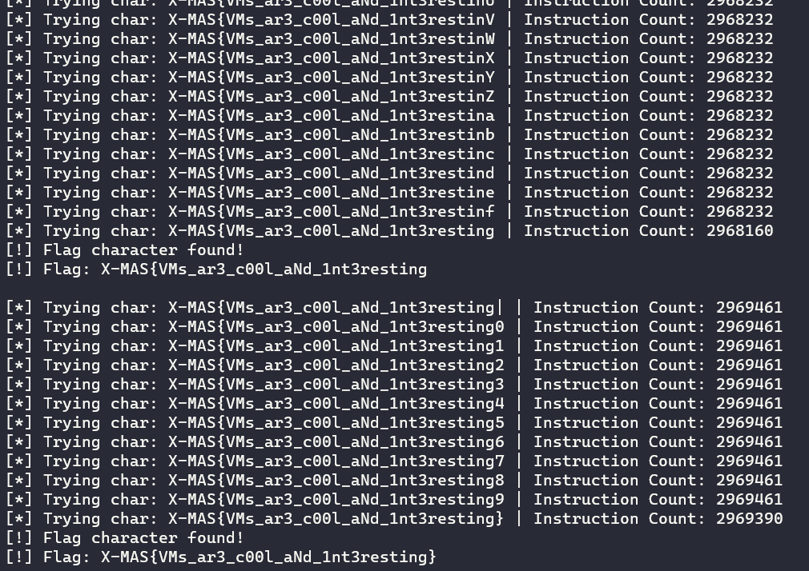

Challenge Author: avlad171

This is a simple stack based VM challenge.  We can solve this in two different ways. 

- Using Intel Pintools to instrument the binary and reading the no of instructions executed.
- Recovering the structure used in the VM and writing a disassembler for it in python.

The former method is easier and can be done within couple of minutes. The latter one will take longer than the former.


## Method 1 — Instrumentation of the binary

The following script will get the flag characters by instrumenting the binary and counting the instructions executed. 

```python
import os
import string

START_CHAR = "|"
POSSIBLE_CHARS = "|" + string.digits + "}{_-" + string.ascii_uppercase + string.ascii_lowercase

def get_count(cmd):
    pipe = os.popen(cmd)
    pipe.readline()
    count = pipe.readline().split()[1]
    return int(count, 0)

## Uncomment for Debug statements

def main():
    cmd = f'echo "{START_CHAR}" | ../../../pin -t obj-intel64/inscount0.so -- ~/VM'
    count_prev = get_count(cmd)
    flag = ""
    j = 0

    while True:
        if "X-MAS{" in flag and "}" in flag:
            break 
        i = POSSIBLE_CHARS[j]
        j+=1
        cmd = f'echo "{flag}{i}" | ../../../pin -t obj-intel64/inscount0.so -- ~/VM'
        if i == "|":
            count_prev = get_count(cmd)
            ##print(f"[*] Trying char: {flag}{i} | Instruction Count: {count_prev}")
            continue
        count = get_count(cmd)
        ##print(f"[*] Trying char: {flag}{i} | Instruction Count: {count}")
        if count == count_prev:
            continue
        elif count != count_prev and 50 < abs(count-count_prev):
				## 50 has been added for error correction while counting 
            flag += i
            ##print(f"[!] Flag character found!")
            print(f"[!] Flag: {flag}\n")
            j = 0
    print(f"[+] Final Flag: {flag}")    

if __name__ == '__main__':
    main()
```
*inscount0.cpp was modified to output the result to the terminal rather than the file*

We can see the output over here,

{{}}

Full script: [discount_vmprotect.py](https://gist.github.com/AmunRha/c734cf68c973aad103f88f7fcde02fef)

I will try to add **Method 2** hopefully when I get the time to do so.


*Note:- This wasn't solved during the CTF and was my personal take since I heard the challenge was good.*