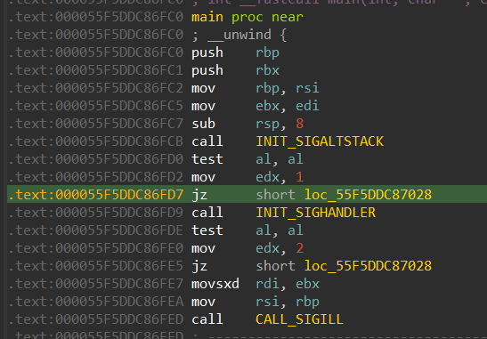

## Description

> x86_64 linux binary (tested on debian 9 and ubuntu 18.04, should run on any distro). Takes one command line argument and outputs "OK!" if it's correct, "Wrong" if it's not.
Partially written in C, actual verification routine is assembly.
Don't patch the binary, of course - find the correct input.

Challenge Author: ttlhacker

## Introduction

This is a wonderful VM crackme that I have ever tried. Since this is my 2nd VM challenge that I have tried, I used the maximum amount of time I can to understand it and try every possible ideas I had in mind, and also cleared out a bunch of doubts and confusions I had as well.

Special Thanks to [@x3ero0](https://x3ero0.github.io/) giving out some tips ;)

This is going to be my version of the hell86 solution in the way I understood it, please feel free to point out any error in my analysis.

## Solution

So let us start with the special case of this VM.

This VM works by defining a signal handler for the opcode `ud2` which will generate a Illegal Signal, or SIGILL.

The VM also defines a separate alternative stack allocated at the heap.

There are many great write ups out there who can explain how the signal handling works, so I am not going to go in depth about it.

The `main()` function calls in 3 other functions, 

- Initializing the Signal Stack
- Initializing the Signal Handler
- Calling first `ud2` instruction to start of the signal handling routine.

{{}}

### Signal Stack initialization

{{}}

 We can see that the `malloc` is called with the size as `0x2000` and the ptr is then passed as the stack pointer for the alternative signal stack.

### Setting the signal handler

{{}}

You can see here that the signal handler function is being set in the signal struct and the func `sigaction` is being passed with the struct.

### Generating the first SIGILL

{{}}

As you can see here, the first `ud2` instruction is executed. But what is `ud2` ?

#### What is `ud2` instruction?

`ud2` instruction is opcode value which will generate a "invalid opcode exception". This is mostly used in software testing to intentionally generate a invalid opcode exception. Intel guarantees that this opcode will always be a undefined instruction.

So what has this got to do with our VM?

This special instruction will generate the `SIGILL` signal, which the VM is dependent on to execute all its other opcode.

To simply say, whenever `ud2` is called, `SIGILL` is generated, which is handled by the custom VM function which then starts with parsing the next 14 bytes from the `ud2` instruction into a structure which will be used to execute our VM opcodes and its respective operations.

### VM handler

{{}}

As you can see this is the start of the VM handler where the structures are initialized.

After analyzing the switch cases, I managed to recover 2 main structures,

- The VM struct

    ```c
    struct vm_struct{
      uint64_t reg0;
      uint8_t opcode;
      uint8_t reg1;
      uint8_t reg2;
      uint8_t reg3;  
    };
    ```

- The bytecode struct

    ```c
    struct bcode_struct
    {
      uint64_t mem[15];
      uint64_t sp;
      uint64_t pc;
    };
    ```

The first one was the structure responsible for storing the bytes appropriately parsed from every 14 bytes after every `ud2` instruction.

The second one is the bytecode structure is more like a memory region in which the values are stored, and further used for the operations defined. It also points to the next block of VM bytes to execute and the alternative stack address that we were speaking about in the beginning.

*p.s. If you have read other write ups or solved the challenge before, you might already see that I didn't see something very obvious in the structure pattern, which I shall explain at the end of this write up*

So, we can see that program counter is updated at the start to point to the next 14 bytes after every `ud2` instruction.

### Disassembling the VM opcodes

There are total of 50 well defined opcodes in this VM, but we don't need to concern with all of them. I ran a small check on which all opcodes are actually used in the given bytecode segment, and only implemented those. 

There was in total of 23 opcodes which were used out of the 50 ones which are defined, so that became an easier task than analyzing all of the opcodes.

*Spoiler alert! or not, most of the opcodes are implemented in the same way as in the x86 assembly. Well, the challenge name ain't lying.*

There were opcodes to handle most of the arithmetic operations, opcodes to push and pop the stack, opcodes to call functions *(yup, there are separate block of vm bytecode for different functions)*, and return statements from those functions.

I chose C to write its disassembler.

```c
// snipping out the previous code here
switch (vm.opcode)
      {
        case 0x1 : 
          bcode.mem[vm.reg1] = bcode.mem[vm.reg2] + bcode.mem[vm.reg3];
          printf(disasm_ins[0], vm.reg1, vm.reg2, vm.reg3);
          break;
        case 0x2 : 
          bcode.mem[vm.reg1] = bcode.mem[vm.reg2] - bcode.mem[vm.reg3];
          printf(disasm_ins[1], vm.reg1, vm.reg2, vm.reg3);
          break;
        case 0x3 : 
          bcode.mem[vm.reg1] = bcode.mem[vm.reg2] * bcode.mem[vm.reg3];
          printf(disasm_ins[2], vm.reg1, vm.reg2, vm.reg3);
          break;
        case 0x8 : 
          bcode.mem[vm.reg1] = -bcode.mem[vm.reg2];
          printf(disasm_ins[3], vm.reg1, vm.reg2);
// snipping out the rest of the code here.
```

### Writing a debugger (kinda)

Well, writing disassembler wasn't enough for me, I wanted as much information from the VM that I can and also I only wanted to see instructions which were executed (like a trace). I went ahead and emulated all the VM instructions in my script finally managing to write a debugger with it to get all the information that I wanted. 

At some places, we can see there are addresses pointing to places in the opcode array. Such addresses are relocatable addresses in the binary, and hence will change their position each time. Rather than taking a dump of the running binary, I just took the last 3 nibbles which didn't seem to change and used that to dereference the array elements. 

```c
bcode.vm_bbl = (int)(vm.reg0 & 0xfff) - (int)BBL_BASE_OFF;
```

That's when I realized that there were a few address which wasn't in the range of offsets of the bytecode and I was confused. They were being dereferenced, although I had a logic implemented to tackle that, this was weird. So, I tried to debug those instructions, it seemed there was `malloc` and `free` called inside VM (*ftw*). Well, since that's the case, I implemented a workaround for that, by initializing an array named heap and just pointed the return address to that.

```c
---------- META DATA -----------
[+] Addr of inp: 0x55d80604b820
[+] Addr of ptr to inp: 0x55d80604bd68
[+] Addr of stack: 0x55d80604bf60
[+] Addr of heap: 0x55d80604be60
[+] Addr of offset check: 0x55d80604b8a0
[+] Addr of ascii chars: 0x55d80604b860
---------------------------------

[0x0] [0] OPCODE - 0x9 ---------
--------- REG VALS ---------
[*] reg0 - 0x2
[*] reg1 - 0xd
[*] reg2 - 0x0
[*] reg3 - 0x0
--------- BCODE STRUCT ---------
mem {
[0x0] - 0x0
[0x1] - 0x0
[0x2] - 0x0
[0x3] - 0x0
[0x4] - 0x0
[0x5] - 0x0
[0x6] - 0x0
[0x7] - 0x0
[0x8] - 0x2
[0x9] - 0x55d80604bd60
[0xa] - 0x55d80604bd60
[0xb] - 0x0
[0xc] - 0x0
[0xd] - 0x0
[0xe] - 0x0
}
res    - 0x55d80604bfc8 (stack[0xd])
vm_bbl - 0x0
--------- STACK ---------
stack { 0x0, 0x0, 0x0, 0x0, 0x0, 0x0, 0x0, 0x0, 0x0, 0x0, 0x0, 0x0, 0x0, 0x1010101, 0x0, 0x0, 0x0, 0x0, 0x0, 0x0, }
--------- HEAP ---------
heap { 0x0, 0x0, 0x0, 0x0, 0x0, 0x0, 0x0, 0x0, 0x0, 0x0, 0x0, 0x0, 0x0, 0x0, 0x0, 0x0, 0x0, 0x0, 0x0, 0x0, 0x0, 0x0, 0x0, 0x0, 0x0, 0x0, 0x0, 0x0, 0x0, 0x0, }
--------------------------------------
mov mem[0xd], 0x2

[0xe] [1] OPCODE - 0x24 ---------
--------- REG VALS ---------
[*] reg0 - 0x2
[*] reg1 - 0x0
[*] reg2 - 0x8
[*] reg3 - 0x0
--------- BCODE STRUCT ---------
mem {
[0x0] - 0x0
[0x1] - 0x0
[0x2] - 0x0
[0x3] - 0x0
[0x4] - 0x0
[0x5] - 0x0
[0x6] - 0x0
[0x7] - 0x0
[0x8] - 0x2
[0x9] - 0x55d80604bd60
[0xa] - 0x55d80604bd60
[0xb] - 0x0
[0xc] - 0x0
[0xd] - 0x2
[0xe] - 0x0
}
// snipping out rest of the output here
```

*Part of the disassembly printed with debugger info*

### Reading the disassembled code

After executing my VM script with sample outputs, I concluded the following.

1. Flag length must be 0x24
2. Checks if input contains "FLAG{" at the start and "}" at the end
3. Checks if the flag is all lowercase+numbers+special_chars and no uppercases,
    1. Allowed characters — `abdfgehikmanoqrstucvwlxyz-01h23p456u78j9-_.+`
4. Gets the index from the allowed array from matching with your input, thereby forming an array of index from the allowed set. This is stored into the heap returned by the malloc (in our case the heap array)
5. Encryption algorithm gets executed and stores the encrypted value back to the heap
6. Final resulting bytes are checked with a stored array of encrypted bytes.

```c
// snipping out previous disassembly here
mov mem[0x2], 0x5623e4e60860
sub mem[0xd], mem[0xd] - mem[0x2]
mov _QWORD[mem[0x1]+0x0], mem[0xd]
mov mem[0x1], mem[0x1] + 0x8
mov mem[0x8], mem[0x8] + 0x1
mov mem[0x9], mem[0x9] + 0xffffffffffffffff
cmp mem[0x9], 0
jnz 0x5591cf15a4a0
push mem[0x1]
push mem[0x0]
push mem[0x8]
push mem[0x9]
mov mem[0x9], _BYTE[mem[0x8]+0x0]
mov mem[0x8], 0x5623e4e60860
call 0x5591cf15a8c8
mov mem[0xd], mem[0x8]
mov mem[0x0], _BYTE[mem[0xd]+0x0]
cmp mem[0x0], 0
jz 0x5591cf15a92a
mov mem[0x0], mem[0x0] == mem[0x9]
ret if mem[0x0] != 0
mov mem[0xd], mem[0xd] + 0x1
mov mem[0x10], 0x5591cf15a8d6
mov mem[0x0], _BYTE[mem[0xd]+0x0]
cmp mem[0x0], 0
jz 0x5591cf15a92a
mov mem[0x0], mem[0x0] == mem[0x9]
ret if mem[0x0] != 0
mov mem[0xd], mem[0xd] + 0x1
mov mem[0x10], 0x5591cf15a8d6
mov mem[0x0], _BYTE[mem[0xd]+0x0]
cmp mem[0x0], 0
jz 0x5591cf15a92a
mov mem[0x0], mem[0x0] == mem[0x9]
ret if mem[0x0] != 0
mov mem[0xd], mem[0xd] + 0x1
mov mem[0x10], 0x5591cf15a8d6
mov mem[0x0], _BYTE[mem[0xd]+0x0]
cmp mem[0x0], 0
jz 0x5591cf15a92a
mov mem[0x0], mem[0x0] == mem[0x9]
ret if mem[0x0] != 0
mov mem[0xd], mem[0xd] + 0x1
mov mem[0x10], 0x5591cf15a8d6
mov mem[0x0], _BYTE[mem[0xd]+0x0]
cmp mem[0x0], 0
jz 0x5591cf15a92a
mov mem[0x0], mem[0x0] == mem[0x9]
ret if mem[0x0] != 0
// snipping out rest of the disassembly here
```

*Part of the cleaner disassembly printed without debugger info*

### Writing the decryption algorithm

Since the algorithm is fairly simple, I went for brute forcing the flag bytes. The range was set to the allowed characters, and the encryption routine was called in checking if it matches the final result.

```c
##include<stdio.h>
##include<stdint.h>

int64_t enc[] = {0x16C8, 0x0FFFFFFFFFFFF8BA1, 0x0FFFFFFFFFFFFE0C0, 0x3600, 0x0FFFFFFFFFFFFE535, 0x16C8, 0x0FFFFFFFFFFFF8BA1, 0x5F45, 0x0FFFFFFFFFFFFD668, 0x0FFFFFFFFFFFFFFF8, 0x5F45, 0x0FFFFFFFFFFFFCA00, 0x0FFFFFFFFFFFFBB58, 0x0AB8, 0x0FFFFFFFFFFFFBB58, 0x4CE3, 0x0FFFFFFFFFFFF8000, 0x2D9, 0x4CE3, 0x0FFFFFFFFFFFFFFFF, 0x2D9, 0x3E8, 0x7D, 0x0FFFFFFFFFFFFE938, 0x200, 0x200, 0x0FFFFFFFFFFFFE535, 0x1F40, 0x0FFFFFFFFFFFFE0C0, 0x0};
int64_t loff[30] = {0};
int64_t lenc[30] = {0};
char inp[] = "x86defghijklmnopqrstuvwxyz01234";
char ascii[] = "abdfgehikmanoqrstucvwlxyz-01h23p456u78j9-_.+";

void encrypt(){
    int k = 0x1e;
    for(int i=0;i<30;i++){
        int a = (loff[i+1] - loff[i]) ^ --k;
        a = a * a * a;
        lenc[i] = a;
    }
}

void find_off(char *inp){
    loff[29] = 0x1e;
    for(int i=0;i<30;i++)
        for(int j=0;j<44;j++)
            if(inp[i] == ascii[j]){
                loff[i] = j; // stores the idx found
                break;
            }
}

int main(){

    int k = 1;
    printf("FLAG{x");
    for(int i=0;i<44;i++){
        if(k == 30)
            break;
        inp[k] = ascii[i]; // tries all possible characters in the set
        find_off(inp);
        encrypt(loff);
        if(lenc[k-1] == enc[k-1]){
            k+=1;
            printf("%c", ascii[i]);
            i=0;
        }
    }
    printf("}\n");

    return 0;
}
```

Running this gives out our flag! 

{{}}

Flag: `FLAG{x86-1s-s0-fund4m3nt4lly-br0k3n}`

### Conclusion

As I said, I eventually realized while discussing about this and reading the write ups that I missed something.

The VM structure of this binary is the similar to the x64 registers struct, and it is the one which is used throughout the whole execution. It uses the actual x64 registers, and not a new one. This also explains why the structure changed its values after the `malloc` and `free` call. 

```c
/*
 * The 64-bit signal frame:
 */
struct sigcontext_64 {
	__u64				r8;
	__u64				r9;
	__u64				r10;
	__u64				r11;
	__u64				r12;
	__u64				r13;
	__u64				r14;
	__u64				r15;
	__u64				di;
	__u64				si;
	__u64				bp;
	__u64				bx;
	__u64				dx;
	__u64				ax;
	__u64				cx;
	__u64				sp;
	__u64				ip;
	__u64				flags;
	__u16				cs;
	__u16				gs;
	__u16				fs;
	__u16				ss;
	__u64				err;
	__u64				trapno;
	__u64				oldmask;
	__u64				cr2;

	/*
	 * fpstate is really (struct _fpstate *) or (struct _xstate *)
	 * depending on the FP_XSTATE_MAGIC1 encoded in the SW reserved
	 * bytes of (struct _fpstate) and FP_XSTATE_MAGIC2 present at the end
	 * of extended memory layout. See comments at the definition of
	 * (struct _fpx_sw_bytes)
	 */
	__u64				fpstate; /* Zero when no FPU/extended context */
	__u64				reserved1[8];
};
```

And therefore you can use gdb or any other elf debugger to debug this VM.

So, that's it folks, that is my solution to the hell86 crackme.

Disassembler,


Decrypter,


Link: 
- [hell86_disassembler.c](https://gist.github.com/AmunRha/2396f09357bb5ef102af9ad48fb58cb7##file-_hell86_disasm-c)
- [hell86_decrypt.c](https://gist.github.com/AmunRha/2396f09357bb5ef102af9ad48fb58cb7##file-hell86_decrypt-c)

### References

- [https://hjlebbink.github.io/x86doc/html/UD2.html](https://hjlebbink.github.io/x86doc/html/UD2.html)

- [https://man7.org/linux/man-pages/man7/signal.7.html](https://man7.org/linux/man-pages/man7/signal.7.html)

- [https://docs.microsoft.com/en-us/windows-hardware/drivers/debugger/x64-architecture](https://docs.microsoft.com/en-us/windows-hardware/drivers/debugger/x64-architecture)

- [https://github.com/torvalds/linux/blob/master/arch/x86/include/uapi/asm/sigcontext.h](https://github.com/torvalds/linux/blob/master/arch/x86/include/uapi/asm/sigcontext.h)