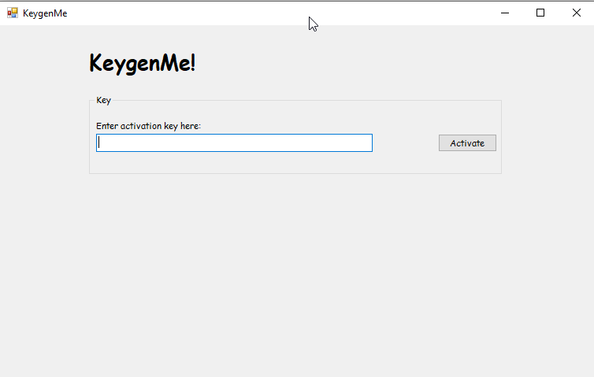

This was a nice challenge which didn't have too much complexity but seemed interesting at the same time! I solved this challenge with the help of my crypto friend [deuterium](https://github.com/deut-erium). This was a rather a different dotNET reversing challenge that I have done till now. This actually had something to reverse xD

So lets get started with the challenge.

## Intro

Running the executable shows us this window,

{{}}

Since this a dotNET reversing challenge, fire up dnSpy and start to decompile the functions.

We can see that there are 6 major functions in the given executable file.

The main function is where it always starts, so lets check that.

{{}}

There is a call to `KeygenForm()` which calls its constructor, which further has a call to `InitializeComponent()`.

{{}}

Well we can definitely see that it initializes a lot of things. Keeping this in our mind we proceed to check the other functions.

We find that the `activate_btn_Click()` function is where the program's core logic is starting at.

## `activate_btn_Click()`

Let's run through what it does.

So, we see that our input is stored inside `this.key_input.Text` which is passed as a parameter to the constructor of the class `keyCheck`

Then we see that another function `keyCheck.Success` is called and the result is checked as well.

Alright, then it has some kind of attribute `keyCheck.KeyBytes` which is passed as a parameter to the constructor of the class `Crypter` . Then the result of the function `crypter.checkKeyId()` is checked.

But wait, we see there is a new parameter here called `KeygenForm.keyId` . Let's see what that contains,

```csharp
private static readonly string keyId = "ed2591b6660b2b05a0e5b22152b120cd59458eb2504c529927ff9a4890b6912e";
```

{{}}

Alright, seems some kind of hash. Depending upon the result returned, the Fail condition will be printed out or the decryption algorithm will run giving us the flag.

Alright, seems fairly easy enough. Why can't we just bypass all these checks and run over to the decryption routine? Good idea, but won't work. We will get to know why once I explain the other functions. 

So we kind of can make sense of what is happening,

- Get input and format it
- Check with the `success` function
- Check with the `crypter` functions
- Run the decryption routine

Let's run over function calls, tracking what happens to our input then.

## `KeyCheck`

### Constructor — `public KeyCheck(string keyStr)`

{{}}

We see the constructor, we can immediately notice that the constructor takes our input and trims it off the newline characters at the start and the end.

Then it splits the input with the delimiter as space — `new char[0]` — and then iterates over the array converting all the words in the array to lower case [this means it doesn't matter if the input is of upper case or lower case letters].

This new list of words are stored into the class member `keywords`

Next, we see the call to `keyCheck.Success` in the parent function we came from, 

```csharp
private void activate_btn_Click(object sender, EventArgs e)
		{
			KeyCheck keyCheck = new KeyCheck(this.key_input.Text);
			this.resultsBox.Visible = true;
			this.flag_label.Visible = false;
			if (!keyCheck.Success)
			{
				this.results_text.Text = string.Format("Failed: {0}", keyCheck.Error);
				return;
			}
			Crypter crypter = new Crypter(keyCheck.KeyBytes);
			if (!crypter.checkKeyId(KeygenForm.keyId))
			{
				this.results_text.Text = string.Format("Invalid KeyID for this build.", new object[0]);
				return;
			}
			string text = crypter.decryptHexString(this.secret_text.Text);
			this.flag_label.Text = text;
			this.flag_label.Visible = true;
			this.results_text.Text = "Product unlocked.";
		}
```

### `keyCheck.Success`

```csharp
public bool Success
		{
			get
			{
				return this.runCheck();
			}
		}
```

It seems to call and return the result of another member function `runCheck()` .

Alright let's head over to that then.

### `runCheck()`

```csharp
private bool runCheck()
		{
			if (this.resChecked)
			{
				return this.success;
			}
			this.resChecked = true;
			if (this.keywords == null)
			{
				this.err = "No key provided.";
				return false;
			}
			if (this.keywords[0] != KeyCheck.keyIdentifier)
			{
				this.err = "Wrong key identifier.";
				return false;
			}
			if (this.keywords.Length != KeyCheck.strength)
			{
				this.err = "Incorrect key strength.";
				return false;
			}
			if (!this.dupeCheck())
			{
				this.err = "Duplicate key pieces.";
				return false;
			}
			int[] array = this.wordsToInts(this.keywords);
			if (array == null)
			{
				return false;
			}
			this.keyBytes = new byte[array.Length * 4];
			for (int i = 0; i < array.Length; i++)
			{
				BitConverter.GetBytes(array[i]).CopyTo(this.keyBytes, i * 4);
			}
			this.success = true;
			return this.success;
		}
```

The function runs over a few checks with our input (stored as a list of words in `keywords`)

So, let's try to pass all these checks one by one with the explanation,

- The list of words must not be empty — Well, the check is self explanatory
- The first word in the list must be equal to `keyCheck.keyIdentifier` , which is "system",

```csharp
private static readonly string keyIdentifier = "system";
```

- The length of the array must be equal to `KeyCheck.strength` , which is 5 — 5 words in total then

```csharp
private static readonly int strength = 5;
```

- All words in the input must be unique — The error code is self explanatory for this, no need to check the code xD

> This function and the previous function gives us the way on how the input must be supplied, which is,
`system word1 word2 word3 word4`

{{}}

So once we do all these we see a new function called `wordsToInts()` being called with the list as the parameter.

Let's see what that does.

### `wordsToInts()`

```csharp
private int[] wordsToInts(string[] words)
		{
			Wordlist instance = Wordlist.Instance;
			int[] array = new int[words.Length];
			int[] array2 = new int[]
			{
				1,
				3,
				11,
				5,
				1
			};
			int num = 85;
			for (int i = 0; i < words.Length; i++)
			{
				int num2 = instance.wordIndex(words[i]);
				if (num2 == -1)
				{
					this.err = string.Format("{0} is not in the dictionary.", words[i]);
					return null;
				}
				array[i] = num2;
				if (i > 0 && num2 % i != 0 && i < words.Length - 1)
				{
					this.err = string.Format("{0} is not indexed correctly.", words[i]);
					return null;
				}
				if (i > 0 && num2 % array2[i] != 0 && i < words.Length - 1)
				{
					this.err = string.Format("{0} is not indexed correctly!", words[i]);
					return null;
				}
				num ^= num2;
			}
			if (num != 0)
			{
				this.err = "Check word does not match.";
				return null;
			}
			return array;
		}
```

Well, ,this seems an interesting function.

So we see that an object of a class `Wordlist` is initialized and a new array of size equal to the size of the keyword array in also initialized. There is another array containing few numbers as well.

Alright let's see what the `Wordlist` can contain

#### Class `Wordlist`

{{}}

Since the function seems pretty easy enough, without going into too much detail I shall explain this part.

This constructor and all the other member function is responsible for getting a resource from a resource file `english.txt` from which every word in it is split up and stored into a dictionary which with `key = word from the file` and `value = index of the array from 0` . Easy enough!

{{}}

`english.txt` resource file ^^

---

So getting back to the previous function `wordsToInts` . We can see that a loop runs till the length of the keyword array. 

The `num2` for each iteration will contain the index of the word(input) in the dictionary.

This is stored into the newly created array `array`.  

Let's see what the checks are [note that the check doesn't matter for i>0 and i<4],

- Every index of the word we found in the dict mod with the countershould result in 0
- Every index of the word we found in the dict mod with the number in the `array2[i]` should result in 0
- And mainly, every index xored starting from the number 85 must result in 0

Alright, this is getting pretty complicated. So how do we pass these checks?

We know the first word that is passed, which is "system" (check above for the explanation). The index of the first word is `1766` . So, let's keep that in our mind as well.

Now, what we want is, the index of the rest of the four words in our input such that it satisfies all these conditions and we get the flag (or so i thought till...)

Assuming that we get the right index, we understand that new `array` will contain the 5 correct index which passes all these checks.

We come across the next loop in the function `runCheck()` after the call to `wordsToInts()` 

```csharp
int[] array = this.wordsToInts(this.keywords);
			if (array == null)
			{
				return false;
			}
			this.keyBytes = new byte[array.Length * 4];
			for (int i = 0; i < array.Length; i++)
			{
				BitConverter.GetBytes(array[i]).CopyTo(this.keyBytes, i * 4);
			}
			this.success = true;
			return this.success;
```

There is a initializing of a new bytearray with the size as `5 * 4` . The loop converts each of those index into equivalent bytearray and stores into `keyBytes` 

example, 

If we have a the index in hex as, `[0x6e6, 0x3e5, 0x434, 0x6b5, 0x3cc]` , then the bytearray will contain, `[e6, 06, 00, 00, e5, 03, 00, 00, 34, 04, 00, 00, b5, 06, 00, 00, cc, 03, 00, 00]` . Essentially, the bytearray converts the hex to a 4 byte array.

So, all good and logical till now I hope!

So, once all these checks are passed and we get this new bytearray formed from the right index of the words from the dict, then the function `runChec()` returns True. 

This is what is passed onto the `Crypter` class constructor inside the `activate_btn_Clic()` function,

 

```csharp
Crypter crypter = new Crypter(keyCheck.KeyBytes);
			if (!crypter.checkKeyId(KeygenForm.keyId))
			{
				this.results_text.Text = string.Format("Invalid KeyID for this build.", new object[0]);
				return;
			}
```

Let's see what the constructor does.

## Class `Crypter`

### Constructor — `public Crypter(byte[] rawkey)`

```csharp
public Crypter(byte[] rawkey)
		{
			SHA256 sha = SHA256.Create();
			this.keyBytes = sha.ComputeHash(rawkey);
		}
```

The bytearray is passed onto the constructor and it creates another attribute `keyBytes` which contains the sha256 hash of the bytearray. 

Next is the `checkKeyId()` function which has the parameter as the encoded hash `keyid`(mentioned above)

```csharp
private static readonly string keyId = "ed2591b6660b2b05a0e5b22152b120cd59458eb2504c529927ff9a4890b6912e";
```

```csharp
public bool checkKeyId(string keyid)
		{
			return this.getKeyID() == keyid;
		}
```

Well, it calls another function `getKeyID()` and the returned value is checked with the passed hash.

### `getKeyID()`

```csharp
public string getKeyID()
		{
			byte[] array = SHA256.Create().ComputeHash(this.keyBytes);
			StringBuilder stringBuilder = new StringBuilder();
			for (int i = 0; i < array.Length; i++)
			{
				stringBuilder.Append(array[i].ToString("x2"));
			}
			return stringBuilder.ToString();
		}
```

> Note: The `keyBytes` mentioned in this code is the data member of this class, which contains the sha256 hash of the bytearray formed from the index of the keywords(check above for explanation)

This function takes in the hash we got before — which is stored in `keyBytes` — and hashes it again : \ 

Then the resulting hash which is in bytearray is converted to a string and returned.

So, the summary of what happened till now is, 

- Supply 5 words with the first word being "system"
- Find the index of the words inside the wordlist and store it in a separate array
- Check the index with certain conditions
- Convert index to bytearray
- sha256 hash it once
- sha256 hash it again
- Check it with the encoded hash value `ed2591b6660b2b05a0e5b22152b120cd59458eb2504c529927ff9a4890b6912e`

Phew! That was fun! So, then we can see what we want to achieve in order to get the hash right!

Now to answer the previous question, Why can't we patch all these and bypass these checks to get to the decryption routine?

## Decryption routine, `decryptHexString()`

The answer, 

```csharp
string text = crypter.decryptHexString(this.secret_text.Text);
```

The function `decryptHexString` is called with the parameter `secret_text.Text` which contains, 

```csharp
this.secret_text.Text = "294b0bee12606b1a8c611727318d7240cfc8c780a386c35758bcaa9e3b181e47";
```

```csharp
public string decryptHexString(string ctext)
		{
			byte[] buffer = Crypter.decodeHex(ctext);
			Aes aes = this.buildCip();
			return new StreamReader(new CryptoStream(new MemoryStream(buffer), aes.CreateDecryptor(), CryptoStreamMode.Read)).ReadToEnd();
		}
```

The hex is converted to a bytearray and an AES routine is called, let's see what the AES routine contains,

```csharp
private Aes buildCip()
		{
			Aes aes = Aes.Create();
			aes.Key = this.keyBytes;
			aes.IV = new byte[16];
			return aes;
		}
```

We see that the `aes.key` is `keyBytes` of this class, which actually contains the first hash that we generated from our bytearray which we formed from the index of the words in the dict. 

So, essentially, we need the right index no matter what to get the AES key right!

Therefore, can't patch it!

Now, onto the real solution.

## Solution

Since we understood what all the necessary functions does we can proceed forming the solution.

We know that we need to get the index right, which will get the hash right and therefore get us the decrypted flag.

To get the index check to pass, we need to get the these conditions right, 

```csharp
private int[] wordsToInts(string[] words)
		{
			Wordlist instance = Wordlist.Instance;
			int[] array = new int[words.Length];
			int[] array2 = new int[]
			{
				1,
				3,
				11,
				5,
				1
			};
			int num = 85;
			for (int i = 0; i < words.Length; i++)
			{
				int num2 = instance.wordIndex(words[i]);
				if (num2 == -1)
				{
					this.err = string.Format("{0} is not in the dictionary.", words[i]);
					return null;
				}
				array[i] = num2;
				if (i > 0 && num2 % i != 0 && i < words.Length - 1)
				{
					this.err = string.Format("{0} is not indexed correctly.", words[i]);
					return null;
				}
				if (i > 0 && num2 % array2[i] != 0 && i < words.Length - 1)
				{
					this.err = string.Format("{0} is not indexed correctly!", words[i]);
					return null;
				}
				num ^= num2;
			}
			if (num != 0)
			{
				this.err = "Check word does not match.";
				return null;
			}
			return array;
		}
```

What do i do? Well, I jump over to making a z3 script! Why? Oh, well i'm a noob!

But guess what? z3 wasn't needed at all and would not be able to solve this within the given time limit of the CTF for sure as well. 

*p.s. i ran the z3 script for maybe 2 hours reaching 100k SAT models but none which is equal to the hash!*

*z3 script here -* solve_z3.py 

Then, I asked my crypto friend [deuterium](https://github.com/deut-erium) for help regarding this, and he whipped out a python script in a few minutes! 0_0 I was impressed and surprised at the speed and the logic of the script, crypto peeps are awesome!

Here is his script, 

```python
from struct import pack
from hashlib import sha256
desired_hash = 'ed2591b6660b2b05a0e5b22152b120cd59458eb2504c529927ff9a4890b6912e'
from tqdm import tqdm
def find():
    num0 = 1766
    for num1 in tqdm(range(0,0x800,3),total=((0x800//3)*(0x800//22)*(0x800//15))):
        for num2 in range(0,0x800,22):
            for num3 in range(0,0x800,15):
                num4 = 85^1766^num1^num2^num3
                if num4 in range(0,0x800):
                    word = pack('<5I',num0,num1,num2,num3,num4)
                    if sha256(sha256(word).digest()).hexdigest() == desired_hash:
                        print(num0,num1,num2,num3,num4)
                        return num0,num1,num2,num3,num4

find()
```

Running this gives us the right index, 

`1766 1263 1210 15 1769` which gives us this combination of words `system over nuclear acid tag` 

Inputting this gives us the flag, 

{{}}

**Flag: `CTF{dot_dot_dot_net_dot_net}`**